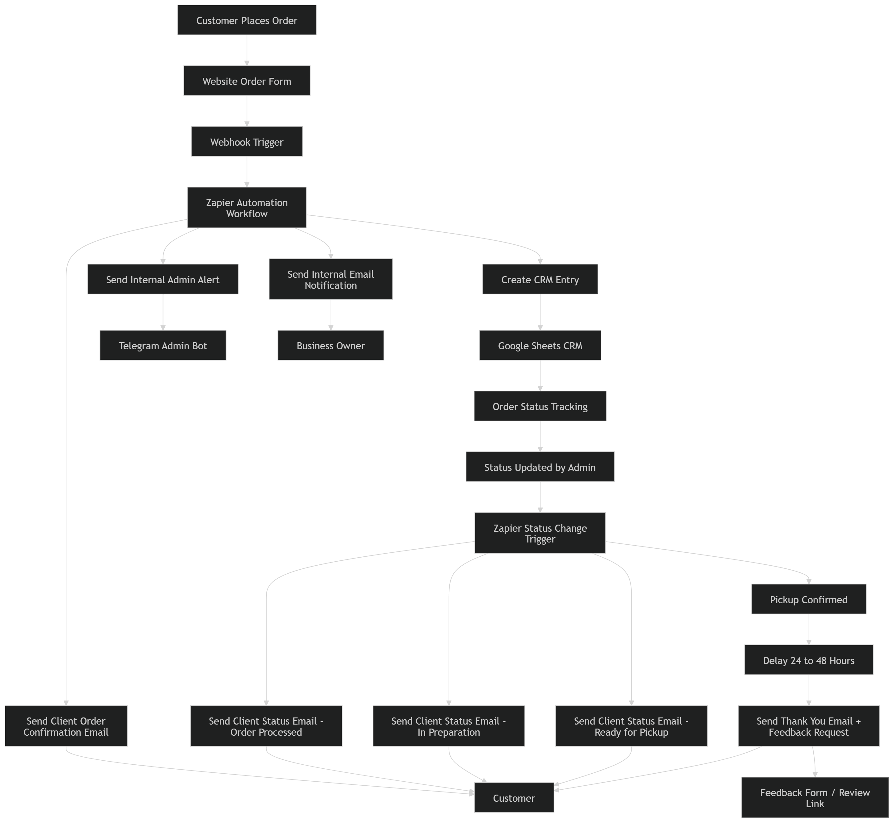
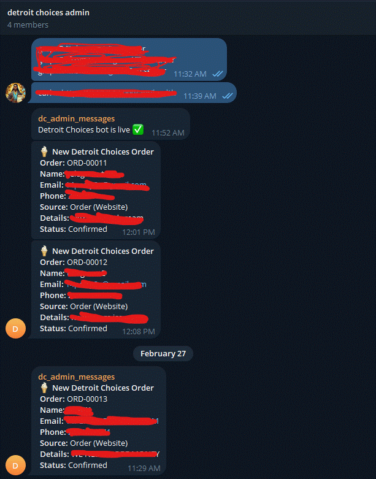

# Detroit Choices Automation Case Study

A portfolio case study documenting the design and implementation of a small-business order automation system built by Malcolm Frank.

---

## Business Challenge

Detroit Choices, a small food business, was managing incoming orders manually across multiple communication channels. This created:

- no centralized order records
- delayed internal response times
- inconsistent customer communication
- manual effort duplicated across admin tasks

The goal was to replace this with a reliable, event-driven automation system using accessible tools — without enterprise software overhead.

---

## Solution Overview

The system connects a customer-facing order form to a structured backend and a series of automated workflows that handle payment, storage, internal coordination, and customer communication end-to-end.

**Order lifecycle:**

1. Customer submits an order on the Detroit Choices website (hosted on Replit)
2. Customer completes payment through Stripe before pickup
3. Replit backend stores the confirmed order in PostgreSQL
4. Backend fires a webhook to Zapier
5. Zapier creates a CRM record in Google Sheets, sends a Telegram admin alert, and sends the customer an order confirmation email
6. Admin manages fulfillment exclusively through the **Telegram admin dashboard** using inline action buttons:
   - Order Being Processed
   - Order Ready for Pickup
   - Order Picked Up
7. Each button press calls back to the Replit backend, which updates PostgreSQL and fires a status webhook to Zapier
8. Zapier auto-syncs Google Sheets and sends the appropriate customer status email
9. When the admin marks an order as **Picked Up**, the backend sets `picked_up_at` and fires a final webhook
10. Zapier waits 24 hours, then sends a thank-you email with a feedback/review link

---

## Architecture

```
Customer → Replit Web App → Stripe Payment → PostgreSQL
                                                  ↓
                                           Webhook → Zapier
                                                  ↓
                              ┌───────────────────┼────────────────────┐
                        Google Sheets CRM   Telegram Admin     Customer Email
                              (auto-synced)    Dashboard        (confirmation)
                                               ↓
                              Admin clicks status button (Telegram)
                                               ↓
                              Replit Backend → PostgreSQL update
                                               ↓
                              Webhook → Zapier → Google Sheets sync
                                               ↓
                                        Customer Status Email
                                               ↓
                              [picked_up] → 24hr delay → Thank-You Email
```

See the full Mermaid diagram in [architecture/system-architecture.md](architecture/system-architecture.md).

---

## Tech Stack

| Layer | Tool |
|---|---|
| Web Application | Replit |
| Database | PostgreSQL |
| Payments | Stripe |
| Secrets Management | Replit Environment Variables |
| Event Triggers | Webhooks (order intake + status updates) |
| Automation Orchestration | Zapier |
| CRM (auto-synced) | Google Sheets |
| Admin Control Surface | Telegram Admin Dashboard (inline buttons) |
| Customer Emails | Email via Zapier |
| Documentation / Portfolio | Git + GitHub |

---

## Repository Contents

```
Detroit-Choices-Automation-Case-Study/
├── README.md                          — this file
├── PROJECT_SUMMARY.md                 — full case study narrative
├── TECH_STACK.md                      — technology stack breakdown
├── DATA_MODEL.md                      — database schema and status lifecycle
├── EVENT_FLOW.md                      — step-by-step event flow documentation
├── TASK_LIST.md                       — completion and review checklist
├── SYSTEM_PROMPT.md                   — repo governance and documentation principles
├── SYSTEM.md                          — repo setup and operating guide
├── .gitignore
│
├── architecture/
│   └── system-architecture.md         — component breakdown + Mermaid diagram
│
├── workflows/
│   ├── zapier-flow-description.md     — detailed Zapier workflow documentation
│   └── sample-webhook-payload.json    — example webhook payload
│
├── artifacts/
│   ├── meeting-notes.md               — project notes and decisions
│   ├── workflow-logic.md              — workflow logic documentation
│   └── implementation-notes.md        — implementation and integration notes
│
├── demo/
│   └── walkthrough-notes.md           — demo script for presenting the project
│
└── screenshots/
    ├── detroit_choices_sys_arch.png   — system architecture diagram
    └── tg_admin_portal.gif            — Telegram admin dashboard demo
```

---

## Screenshots

**System Architecture Diagram**



**Telegram Admin Dashboard**



---

## Why This Case Study Matters

This project demonstrates a practical, production-deployed automation system built for a real small business using widely available tools.

It shows:

- **systems thinking** — connecting payment, database, backend, event triggers, and multi-channel communications into a coherent pipeline
- **implementation ability** — the system was fully designed and deployed, not theorized
- **event-driven architecture** — backend webhook events drive all downstream automation; no manual CRM updates required
- **admin UX design** — Telegram inline buttons as the sole fulfillment control surface, keeping admin workflow entirely in one tool
- **customer lifecycle management** — automated communication from order confirmation through post-pickup thank-you

The architecture is deliberately lightweight and accessible, demonstrating how practical automation can be built without expensive enterprise platforms.

---

Built by **Malcolm Frank**
