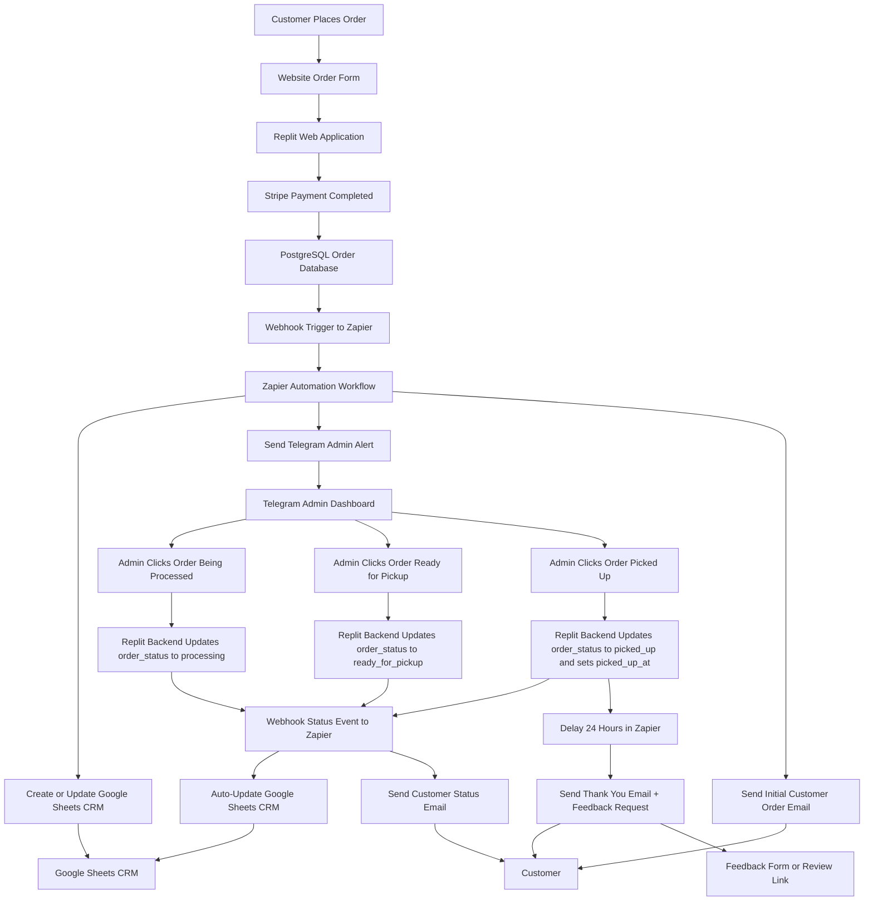

# Detroit Choices Automation System Architecture

## Architecture Overview

The Detroit Choices Automation System is designed as an event-driven workflow architecture connecting a Replit-hosted web application, Stripe payment processing, PostgreSQL order database, Telegram admin dashboard, Zapier automation, auto-synced Google Sheets CRM, and customer email communications.

The system operates through two distinct webhook-driven flows:

1. **Order intake flow** — triggered after Stripe payment completes and the order is written to PostgreSQL
2. **Status update flow** — triggered by the Replit backend each time the admin acts through the Telegram admin dashboard

PostgreSQL is the **system of record**. Google Sheets is a **downstream auto-synced view**. The Telegram admin dashboard is the **sole admin control surface**.

---

## Core System Components

### Website Application

The Detroit Choices website is built and hosted on **Replit**.

- provides the customer-facing order submission form
- runs the backend application logic
- handles Stripe payment confirmation before writing orders to the database
- fires webhook events to Zapier on both order creation and status changes
- exposes callback endpoints for Telegram admin dashboard button actions
- stores all credentials and API keys as Replit Secrets (environment variables)

---

### Stripe Payment Processing

Stripe handles customer payment as part of the order intake flow.

- the customer completes payment through Stripe before the order is finalized
- the backend writes the order to PostgreSQL only after payment is confirmed
- Stripe payment completion is not the trigger for the thank-you email — that is triggered by the `picked_up` status event

---

### PostgreSQL Database

PostgreSQL is the **primary system of record** for the automation system.

The `orders` table stores:

- customer information
- order details and quantities
- Stripe payment reference
- order status (`new`, `processing`, `ready_for_pickup`, `picked_up`)
- timestamps (`submitted_at`, `status_updated_at`, `picked_up_at`)

All status changes are written to PostgreSQL by the Replit backend before any downstream automation is triggered. Zapier and Google Sheets reflect the database state — they do not control it.

---

### Webhook Events

The backend fires two types of webhook events to Zapier:

1. **Order intake webhook** — fires after Stripe payment complete and order written to PostgreSQL
2. **Status update webhook** — fires after each admin button press updates PostgreSQL

Webhooks carry structured JSON payloads containing the order state at the time of the event.

---

### Zapier Automation Engine

Zapier is the central automation orchestration layer.

**Zap 1 — Order Intake** (webhook trigger):
- receives incoming order webhook
- creates a Google Sheets CRM row
- sends Telegram admin alert with order details and action buttons
- sends customer order confirmation email

**Zap 2 — Status Updates** (webhook trigger from backend):
- receives status webhook from Replit backend
- auto-syncs the Google Sheets CRM row with updated status
- routes to appropriate customer email based on status value
- on `picked_up`: waits 24 hours, then sends thank-you + feedback email

---

### Telegram Admin Dashboard

The Telegram admin dashboard is the **sole admin control surface** for fulfillment management.

When a new order arrives, the admin receives an alert in Telegram with the order details and three inline action buttons:

- **Order Being Processed** → backend sets `order_status = 'processing'`
- **Order Ready for Pickup** → backend sets `order_status = 'ready_for_pickup'`
- **Order Picked Up** → backend sets `order_status = 'picked_up'` and records `picked_up_at`

Each button press sends a callback to the Replit backend. The backend updates PostgreSQL and fires a status webhook to Zapier. The admin never manually edits Google Sheets or any other system.

---

### Google Sheets CRM

Google Sheets functions as a **lightweight, auto-synced downstream CRM view**.

- populated by Zapier immediately on order intake
- updated by Zapier on each status change event
- provides a readable log of all orders and current statuses
- is written to exclusively by Zapier — it does not trigger any automation

Google Sheets is a **visibility layer**, not a control surface.

---

### Customer Communication Automation

Customers receive automated emails managed by Zapier across the full order lifecycle:

- **Order confirmation** — immediately after order intake webhook
- **Order processing** — when `order_status = 'processing'`
- **Ready for pickup** — when `order_status = 'ready_for_pickup'`
- **Thank-you + feedback** — 24 hours after `order_status = 'picked_up'`

---

## System Architecture Diagram

