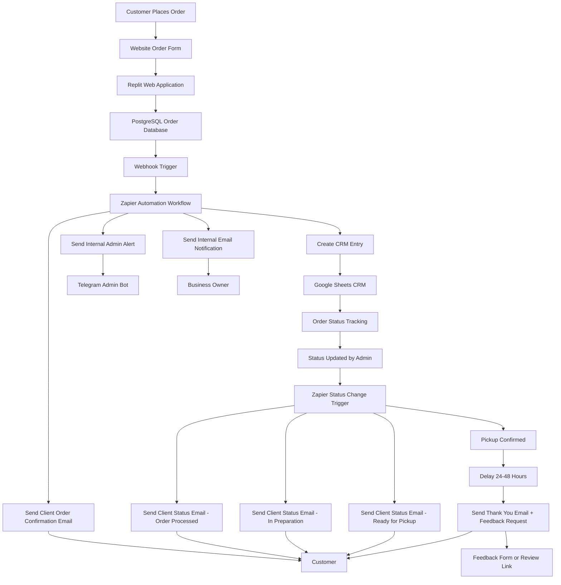

# Detroit Choices Automation System Architecture

## Architecture Overview

The Detroit Choices Automation System is designed as an event-driven workflow architecture connecting a web application, database storage, automation workflows, and communication services.

The system ensures that customer orders move through a structured lifecycle from submission to fulfillment and post-order feedback.

---

## Core System Components

### Website Application

The Detroit Choices website was built and deployed using **Replit** as the development and hosting environment.

The application includes:

- customer order submission form
- backend logic for order processing
- environment variables used for storing API keys and service credentials

---

### PostgreSQL Database

Incoming order data is stored in a **PostgreSQL database** connected to the website backend.

The database acts as the primary data store for:

- customer information
- order details
- timestamps
- order status fields

The database ensures that all order data is securely stored and structured before being processed by automation workflows.

---

### Webhook Trigger

When an order is submitted, the system generates a **webhook event** that sends order data into the automation pipeline.

The webhook pulls structured order information from the database and sends it to Zapier for workflow processing.

---

### Zapier Automation Engine

Zapier acts as the central orchestration layer for the automation system.

Zapier workflows handle:

- webhook intake
- order data parsing
- CRM record creation
- internal notifications
- customer messaging
- post-order follow-up

---

### Google Sheets CRM

A Google Sheets document functions as a lightweight CRM system.

The CRM stores structured order data and allows administrators to:

- track incoming orders
- update order status
- manage operational workflows

Zapier monitors changes in this sheet to trigger status update emails to customers.

---

### Internal Notifications

Administrators are notified when orders are received through:

- Telegram bot alerts
- internal email notifications

These alerts ensure the team is immediately aware of new orders.

---

### Customer Communication Automation

Customers receive automated emails throughout the order lifecycle:

- order confirmation
- order processing updates
- ready-for-pickup notification
- post-order thank-you message

---

## System Architecture Diagram

